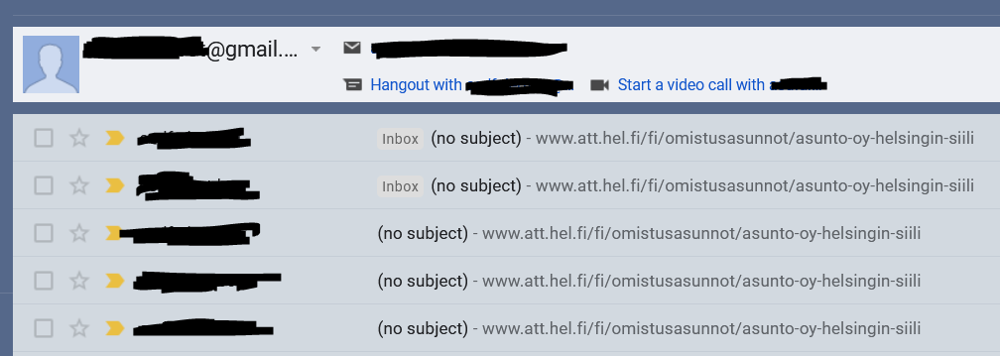

**hitas-email-alert**

This is a simple python script for web scraping and sending alert messages from the triggered changes.

---

It compares the count of words "Vapaa" in received HTTP response. If the count has changed to a bigger value event is triggered that sends a link to the site as an email.

I chose to run this with crontab job and store the count variable in log.txt.

---

Project was run on a google cloud VM instance.
- f1-micro
- Ubuntu 20.4 LTE
- Crontab
- Python
    - `requests`
    - `smtplib`
    - `ssl`
